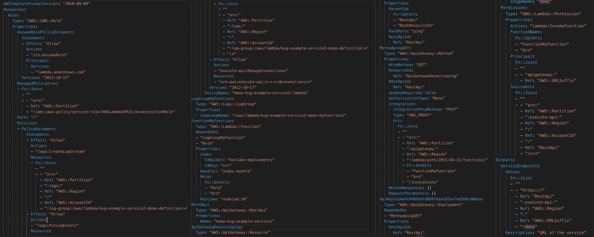

## HexLabs


Note: 1. Introduce Hexlabs
2. Show Hexlabs.io 
3. Show Github
4. Agenda

---
## CloudFormation
- Templating system to deploy AWS resources
- Infrastructure as Code (Config)
- Automation and Repeatability
Note: 1. Infra in version control
2. CloudFormation simplifies provisioning and managing resources. We just create templates for the services and applications we want to build. CloudFormation uses those templates to provision the services and applications, called stacks. We can easily update and replicate the stacks as needed. We can combine and connect different types of resources to create a stack.
3. Infrastructure-as-Code
A template can be used repeatedly to create identical copies of the same stack (or to use as a foundation to start a new stack). Templates are simple YAML- or JSON-formatted text files that can be placed under our normal source control mechanisms, stored in private or public locations such as Amazon S3, and exchanged via email. With CloudFormation, we can see exactly which AWS resources make up a stack. we retain full control and have the ability to modify any of the AWS resources created as part of a stack.
4. Intelligent updating & rollback
CloudFormation not only handles the initial deployment of our infrastructure and environments, but it can also manage the whole lifecycle, including future updates. During updates, we have fine-grained control and visibility over how changes are applied, using functionality such as change sets, rolling update policies and stack policies.
---
##  CloudFormation Quiz 
Resource 1
```yaml
AWSTemplateFormatVersion: "2010-09-09"
Resources:
  ec2SecurityGroup:
    Type: "AWS::EC2::SecurityGroup"
    Properties:
      GroupDescription: "sec-group-1"
  Instance:
    Type: "AWS::EC2::Instance"
    Properties:
      ImageId: "ami-012344"
      InstanceType: "t2.micro"
      SecurityGroups:
      - Ref: "ec2SecurityGroup"
```
Note: 1. EC2 instance created

----
## CloudFormation Quiz 
#### Resource 2
```yaml
AWSTemplateFormatVersion: "2010-09-09"
Resources:
  Table:
  Type: "AWS::DynamoDB::Table"
  Properties:
    KeySchema:
    - AttributeName: "principalId"
      KeyType: "HASH"
    AttributeDefinitions:
    - AttributeName: "principalId"
      AttributeType: "S"
    TableName: "ddb-table"
```
Note: 1. Failed: Type should be indented further
----
## CloudFormation Quiz 
#### Resource 3
```yaml
AWSTemplateFormatVersion: "2010-09-09"
Resources:
  SQSLogicalQueueName:
    Type: "AWS::SQS::Queue"
    Properties:
      ...
      QueueName: "SqsQueueName"
  Topic:
    Type: "AWS::SNS::Topic"
    Properties:
      Subscription:
      - Endpoint:
          Fn::GetAtt:
          - "SqsLogicalQueueName"
          - "Arn"
        Protocol: "sqs"
```
Note: 1. Failed: Attribute name case sensitive "SqsLogicalQueueName" != "sqsLogicalQueueName"
----
## CloudFormation Quiz 
#### Resource 4

---


- Coverage of over 400 AWS resouces
- DSL for building CloudFormation templates
- Modules to compose common resources
- <a href="https://kloudformation.hexlabs.io" target="_blank">https://kloudformation.hexlabs.io</a>

Note: 1. CloudFormation with a 'K'
2. Talk about how this number of resources where obtained
3. Really this is Chris Barbours baby but he was off having another one.
4. Great for Name text, not great for talking about, 
5. Try to say aws/Kotlin CFT from now on, please heckle when I don't
6. Other methods are available (Terraform, CDK, Troposphere)
7. AWS CDK: Completely new domain to learn, Java Builder pattern, Required properties not required, Supports multiple languages to write in
8. Troposphere: 3 years of maturity,  Manually updated by many people (not generated),  Python

---

## Kotlin DSL Examples
Kotlintest
```kotlin
class StringSpec : ShouldSpec({
  should("return the length of the string") {
    "sammy".length shouldBe 5
    "".length should be(0)
  }
})
```
Note: 1. Talk through some of the features and conventions 
    that help to create DSLs in Kotlin
    2. Reads well, but how is it done????
braces after should(), lambda in the last parameter
2. should/shouldBe infix (next slide)
----
## Kotlin DSL Examples
Infix notation
```kotlin
"sammy".length shouldBe 5
"".length should be(0)
```
```kotlin  
infix fun Int.shouldBe(expected:Int): Boolean =
  this == expected

infix fun Int.should(matcher: Matcher<Int>): Boolean =
  matcher.test(this)
```
Note: 1. Extension functions easily created
2. infix keyword must be an extension function, this is why be parenthesis on be
----
## Kotlin DSL Examples
Trailing Lambda Receivers
```kotlin
data class TestContext(val name: String) {
  fun printlnUpper() = println(copy(name.toUpperCase()))
  fun printlnLower() = println(copy(name.toLowerCase()))
}
fun should(name: String, test: TestContext.() -> Unit) =
  TestContext("should $name").apply(test)
```
----
## Kotlin DSL Examples
Trailing Lambda Receivers
```kotlin
fun should(name: String, test: TestContext.() -> Unit) {
  val testContext = TestContext("should $name")
  testContext.test()
  testContext
}
should("testName") {
  printlnLower()
  printlnUpper()
}
// TestContext(name=should testname)
// TestContext(name=SHOULD TESTNAME)
```

----
## Kotlin DSL Examples
Operator overloading
```kotlin
data class Money(val amount: Double)
operator fun Money.plus(m: Money) = Money(amount + m.amount)

Money(5.01) + Money(10.05)
//Money(amount=15.06)
```
```kotlin
data class Path(val pathValue: String)
operator fun Path.div(subPath: String) = 
    Path("$pathValue/$subPath")

val root = Path("")
root / "usr" / "local" / "bin"
//Path(pathValue=/usr/local/bin)
```
Note: 1. Kotlin allows us to change the functionality of some operators
2. infix keyword, this is why be parenthesis on be
----
## Kotlin DSL Examples
DSLMarkers
```kotlin
@DslMarker
annotation class KloudFormationDsl
class KloudFormationTemplate {
    @KloudFormationDsl
    class Builder {
        fun s3Bucket(b: S3Bucket.Builder.() -> Unit): S3Bucket
        fun snsTopic(): SNSTopic
    }
}
class S3Bucket {
    @KloudFormationDsl
    class Builder {
        bucketName(bucketName: String) = ...
    }
}
```

----
## Kotlin DSL Examples
DSLMarkers
```kotlin
KloudFormationTemplate.create {
    s3Bucket{
        bucketName("bucket-name") // works
        snsTopic() //doesn't work
    }
}
```

---


# DEMO

Note: Show how to install CLI

kloudformation init

kloudformation idea

Build a simple S3 bucket explaining the parts of the DSL

kloudformation transpile

kloudformation deploy

Show bucket

Show more complex example... (intrinsic functions outputs parameters)

Show Builder

---

## DSLs on DSLs
Module: set of steps to create number of CloudFormation resources
Parts: Resource builders that expose a subset of properties
        
Note:  Module System - DSL built from another DSL

Show Serverless

Build Serverless end to end example

---

## Tooling for the tooling

- kloudformation runner
- gradle plugin
- Invert CFT to Kotlin

---
## Get involved
- Kotlinlang Slack : KloudFormation
- New modules: ECS, Fargate, Alexa ....... 

